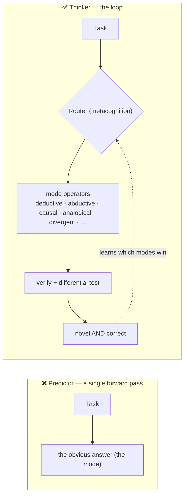

<div align="center">

# 🧠 divergent-agents

### Turning general-purpose coding agents from next-move *predictors* into *divergent thinkers*.

[](research/verification.md)
[](research/verification.md)
[](docs/BENCHMARKS.md)
[]()
[]()
[-orange)](RESULTS.md)

*A research-and-build effort: survey **every** method for making an LLM think outside the box (every paper
verified real), ship a working **engine** that does it, and **benchmark it honestly** — wins, nulls, and all.*

</div>

---

> Today's LLM agents are trained to predict the single most-likely next move. That makes them reliable and
> **trapped**: they converge on the obvious answer and rarely push past it. You don't escape that by asking
> the model to "be creative." You escape it by wrapping the model in a **process** — one that refuses the
> mode, remembers what it already tried, recombines, searches, and verifies.

> ### 💡 Intelligence we'd call *thinking* does not live in the forward pass. It lives in the **loop around it.**



---

## 🏆 Results at a glance

Six benchmarks, every number reproducible, **generation and scoring always separated** (the model that
writes answers never grades them). Full scoreboard + reproduce commands: **[`docs/BENCHMARKS.md`](docs/BENCHMARKS.md)**.

| # | Benchmark | The honest finding |
|:-:|---|---|
| **1** | [Divergent Association Task](RESULTS.md) | Prompting *"be divergent"* is a **null** (p=0.84). The structural **novelty archive lifts diversity +0.229 (p<0.0001)**, no quality cost. |
| **2** | [Coding solution diversity](RESULTS.md) | Best-of-N collapses to **1 algorithm** (10/10 identical `fib`); the engine yields **~9× more distinct correct solutions**. |
| **3** | [Cognitive routing](RESULTS.md) | Accuracy is a **100% ceiling** — but the router picks **9/10 distinct mode-plans** (diagnosis→abductive, proof→deductive, …). |
| **4** | [Proper pass@k](RESULTS.md) | On novel problems, unbiased pass@k, compute-matched: **near-perfect ceiling, no coverage gap.** The methodologically-correct negative. |
| **5–6** | [Robustness via differential testing](demos/04-differential-testing.md) | Diverse solutions **police each other** — shipped-bug rate cut **~28×** (k=1→k=7); 657/657 idiosyncratic bugs caught. **The first win on correctness.** |
| **L** | [Closed learning loop](engine/close_loop.py) | Trained on the real diversity signal, routing **generalizes out-of-sample** (`maximize_diversity → archive`, **+0.232**). |

> **The synthesis.** A frontier model is at the *accuracy ceiling* on anything you can construct-and-check —
> so "more thinking" does **not** buy accuracy on solvable problems, and we never pretend it does. Its real,
> measured value: escaping **mode collapse** (B1), **covering the solution space** (B2), **routing the right
> mode** (B3), and turning **diversity into a correctness oracle** (B5–6). Honest limit: differential testing
> catches *idiosyncratic* bugs, not *systematic* ones — agreement is never proof of correctness.

---

## ⚙️ The two engines

- **🧭 [Cognitive Engine (v2)](COGNITION.md)** — a metacognitive **router** over a **12-mode thinking library**
  (deductive, inductive, abductive, analogical, decompose, causal, Bayesian, dialectic, first-principles,
  convergent-verify, metacognitive, and *divergent*). It diagnoses what kind of thinking a task needs and
  composes the right sequence — *the engine that does the most kinds of thinking.*
- **🌿 [Divergence Engine (v1)](METHOD.md)** — the original divergent-breadth method (now just *one mode* in v2):
  name the mode → tail-sample → novelty archive → recombine → tree-search → adversarially verify → frontier-select.

Both are grounded **paper-by-paper** in the verified research, and both run as either an inline skill or a
real fan-out workflow with parallel subagents.

---

## 🗺️ Repository map

| Path | What |
|---|---|
| **[`COGNITION.md`](COGNITION.md)** · **[`METHOD.md`](METHOD.md)** | The methods — the Cognitive Engine (v2) and the Divergence Engine (v1), grounded stage-by-stage. **Start here.** |
| **[`docs/BENCHMARKS.md`](docs/BENCHMARKS.md)** · **[`RESULTS.md`](RESULTS.md)** | The scoreboard and the full results (CIs, caveats, nulls included). |
| **[`BENCHMARKING.md`](BENCHMARKING.md)** | The *best honest tactic* for benchmarking divergence — 5 principles + traps, from 23 verified papers. How not to fool yourself. |
| [`engine/`](engine/) | Cognitive Engine: `cognitive_engine.js` (router + modes), `modes.json` (library), `learn.py` + `close_loop.py` (learning), `diff_test.py` (differential testing). |
| [`harness/divergence_engine.js`](harness/divergence_engine.js) | Fan-out Divergence Engine — parallel subagents per lens + per refuter (run via the Workflow tool). |
| [`skill/`](skill/) | `/diverge` (inline divergence) and `/robust-solve` (write correct code by cross-checking diverse solutions). |
| [`bench/`](bench/) | The benchmark harness — objective scorers (embedding ensemble, brute-validated checkers), bootstrap + permutation stats, raw data. |
| [`research/`](research/) | **137 papers across 3 corpora, every one verified real** ([`REPORT.md`](research/REPORT.md), [`verification.md`](research/verification.md), [`thinking-modes/`](research/thinking-modes/)). |
| [`demos/`](demos/) | Real runs captured verbatim — [self-collapse detector](demos/01-self-collapse-detector.md), [router differentiation](demos/02-router-differentiation.md), [end-to-end engine](demos/03-cognitive-engine-run.md), [differential testing](demos/04-differential-testing.md). |

---

## ⚡ Quickstart

```bash
# objective scorers + self-checks (stdlib + numpy only)
python bench/score.py                 # DAT / diversity scorer (embedding ensemble)
python engine/diff_test.py            # differential tester (catches a planted bug)
python engine/close_loop.py           # learning loop — learns + generalizes out-of-sample

# reproduce a benchmark
python bench/run_dat.py               # Benchmark 1  (prompting null vs archive win)
python bench/robustness.py 600        # Benchmark 6  (shipped-bug rate vs k)
```

Use the engine in **Claude Code**:
```bash
cp -r skill/divergence skill/robust-solve ~/.claude/skills/     # then /diverge  or  /robust-solve
```
```js
// or the fan-out engine, via the Workflow tool:
Workflow({ scriptPath: "engine/cognitive_engine.js", args: { task: "<your task>" } })
```

---

## 🔒 How we kept ourselves honest

This is the part most "creativity" projects skip — and the reason the results are trustworthy.

- **Every citation verified twice**, by independent means (arXiv API + Semantic Scholar / Crossref):
  **137 / 137 papers real, 0 fabricated.**
- **Generation ≠ scoring.** Objective metrics (embeddings, brute-force-validated checkers cross-checked on
  350+ cases) carry every headline. **No LLM-judge claims** — we lack a clean cross-family judge, so we make none.
- **Nulls and artifacts are reported, not buried** — the prompting null (B1), the accuracy ceiling (B3/B4),
  and a grading artifact we *caught and fixed* (B3) are all in the open.

---

## 🎯 Principle

> **Ambition over caution.** The goal is not "an agent that is competent" — it's an agent whose output
> *stops you in your tracks.* Difficulty is the specification, not a deterrent.
