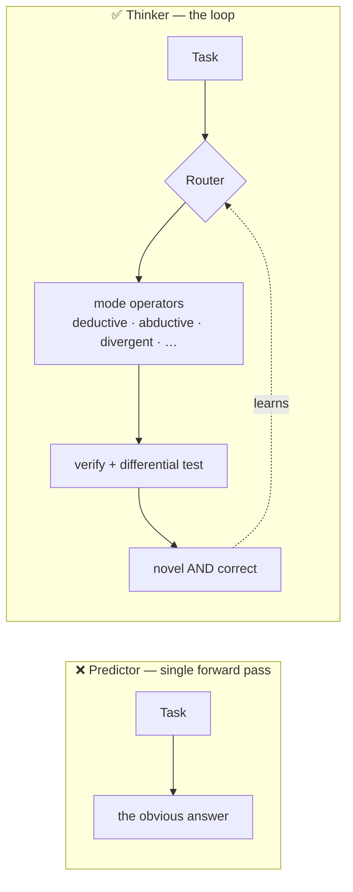

<div align="center">

# 🧠 divergent-agents

### Turning coding agents from next-move *predictors* into *divergent thinkers*.

[](research/verification.md)
[](research/verification.md)
[](docs/BENCHMARKS.md)
[](RESULTS.md)

</div>

> LLMs predict the most-likely next move — reliable, and **trapped** on the obvious answer. You don't fix
> that by asking the model to "be creative"; you wrap it in a **loop** that refuses the mode, remembers what
> it tried, recombines, searches, and verifies.
>
> **💡 Thinking doesn't live in the forward pass. It lives in the loop around it.**



## 🏆 Results — six benchmarks, every number reproducible, nulls included

| # | Benchmark | Honest finding |
|:-:|---|---|
| 1 | Divergent Association Task | Prompting *"be divergent"* is a **null** (p=0.84); the structural **archive lifts diversity +0.229** (p<0.0001), no quality cost. |
| 2 | Coding diversity | Best-of-N collapses to **1 algorithm**; the engine yields **~9× more distinct correct solutions**. |
| 3 | Cognitive routing | Accuracy is a **100% ceiling** — but the router picks **9/10 distinct mode-plans** per task. |
| 4 | Proper pass@k | Unbiased, compute-matched: **near-perfect ceiling, no coverage gap.** The correct negative. |
| 5–6 | Robustness (differential testing) | Diverse solutions cross-check each other → shipped-bug rate cut **~28×**. *The first win on correctness.* |
| L | Closed learning loop | Routing learned from a real signal **generalizes out-of-sample** (+0.232). |

Full scoreboard + reproduce commands → **[`docs/BENCHMARKS.md`](docs/BENCHMARKS.md)** · details + CIs → **[`RESULTS.md`](RESULTS.md)**

> A frontier model is at the *accuracy ceiling* on anything you can construct-and-check, so "more thinking"
> doesn't buy accuracy on solvable problems — and we never pretend it does. Its measured value is escaping
> **mode collapse**, **covering the solution space**, **routing the right mode**, and making **diversity a
> correctness oracle**.

## 🗺️ What's inside

| | |
|---|---|
| **[`COGNITION.md`](COGNITION.md)** | The **Cognitive Engine** — a router over a 12-mode thinking library (deductive, abductive, causal, divergent…). **Start here.** |
| [`METHOD.md`](METHOD.md) | The **Divergence Engine** — the divergent-breadth method (now one mode in v2). |
| [`engine/`](engine/) · [`skill/`](skill/) | The engines + the `/diverge` and `/robust-solve` skills. |
| [`bench/`](bench/) · [`BENCHMARKING.md`](BENCHMARKING.md) | The benchmark harness + the *honest tactic* for measuring divergence. |
| [`research/`](research/) | **137 papers across 3 corpora, every one verified real** ([ledger](research/verification.md)). |
| [`demos/`](demos/) | Real engine runs, captured verbatim. |

## ⚡ Quickstart

```bash
python engine/diff_test.py     # differential tester (catches a planted bug)
python engine/close_loop.py    # learning loop — learns + generalizes out-of-sample
python bench/robustness.py 600 # Benchmark 6: shipped-bug rate vs k
```
**Install the skills** (`/diverge`, `/robust-solve`) — one command, then restart Claude Code:

```powershell
powershell -ExecutionPolicy Bypass -File skill\install.ps1   # Windows
```
```bash
sh skill/install.sh                                          # macOS / Linux
```

Full install options (per-OS paths, project scope, manual copy) → **[`skill/README.md`](skill/README.md)**.

## 🔒 Honest by construction

Every citation verified twice (**137/137 real, 0 fabricated**). Generation ≠ scoring — objective metrics
carry every headline, **no LLM-judge claims**, and nulls/artifacts are reported, not buried.

> **Ambition over caution** — output that *stops you in your tracks.* Difficulty is the spec, not a deterrent.
